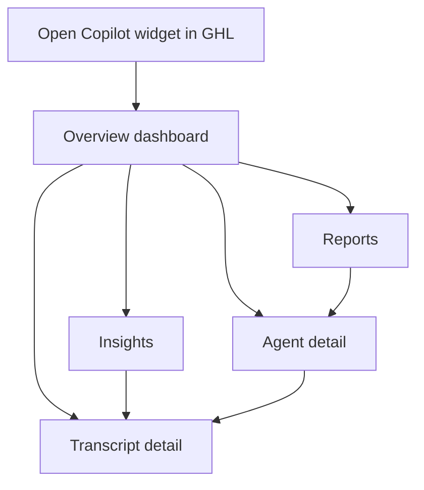
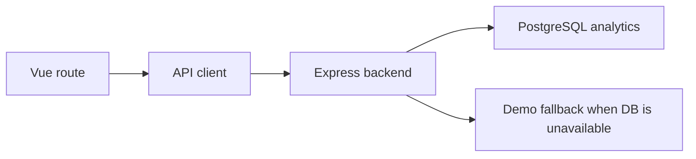

# Frontend README

Vue 3 renders the embedded analytics experience for the Voice AI Observability Copilot. It uses Vite, hash routing for iframe safety inside HighLevel, plain CSS, and Chart.js for the dashboard visualizations.

## New Features

### New Views
- **`src/views/Insights.vue`**: Coaching priorities, review queue, and failure signal detection
- **`src/views/Reports.vue`**: Agent benchmarks, score distribution, failure concentration, and operating snapshots
- **`src/views/Assistant.vue`**: AI-powered Q&A interface for querying call quality data

### Components
- **`src/components/InsightCard.vue`**: Reusable card for displaying AI recommendations and insights
- **`src/components/KpiScoreCard.vue`**: KPI score display with trend indicators

## Local Run

```bash
npm install
npm run dev
```

Create `frontend/.env`:

```bash
VITE_API_BASE_URL=http://localhost:3000
```

## Navigation

- `#/` shows the executive observability dashboard.
- `#/reports` shows agent benchmarks, score distribution, failure concentration, and operating snapshot.
- `#/insights` shows recommended actions, review queue, and repeated failure signals.
- `#/assistant` shows AI-powered suggestions and Q&A interface.
- `#/agents/:id` shows one agent's KPI breakdown, recommendations, and recent calls.
- `#/transcripts/:id` shows one call transcript with highlighted failures and suggested actions.

## User Flow



## Data Flow



## Design Notes

The UI is intentionally dense and operational: smaller KPI cards, persistent sidebar navigation, table-first review workflows, and report pages that emphasize scanning and comparison over marketing-style presentation.

## Verification

```bash
npm run lint
npm run build
```
